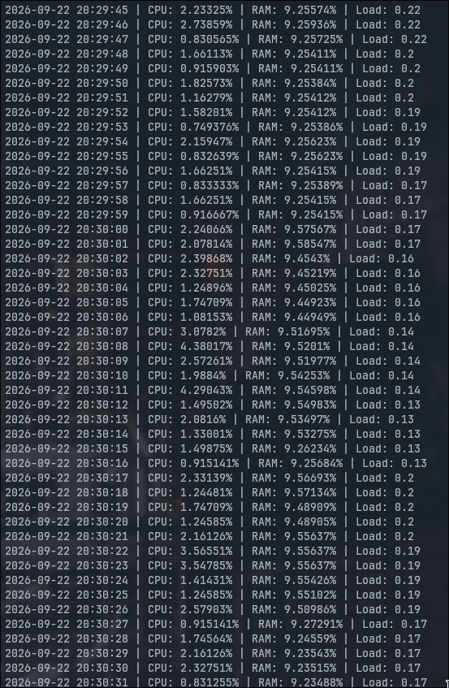

#SysInsight

A lightweight system performce monitor and anomaly detector for linux.

## Methodology
- C++17 collector reads reads /proc/stat, /proc/meminfo and proc/loadavg and logs to CSV
-Python ML script runs isolation forest anomaly detection on that logged data
-A terminal based dashboard shows the live statistics and the anomaly flags

## Collector build
mkdir -p build && cd build
cmake ..
make

##Run
1. Start the collector(./build/collector)
2. Start the dashboard(python dashboard.py)

## Requirements
-Linux, g++ with c++17,CMake
-Python 3 with pandas and scikit-learn
