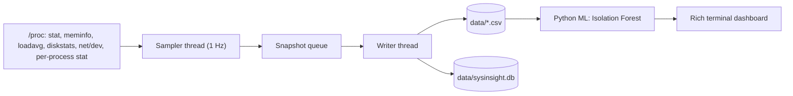

#SysInsight

A lightweight system performce monitor and anomaly detector for linux.

## Methodology
- Multithreaded C++17 collector samples CPU, RAM, load, disk I/O, network and the top processes every second, and logs to CSV and SQLite
-Python ML script runs isolation forest anomaly detection on that logged data
-A terminal based dashboard shows the live statistics and the anomaly flags

## Collector build
mkdir -p build && cd build
cmake ..
make

##Run
1. Start the collector(./build/collector)
2. Start the dashboard (in a second terminal: cd ml && python3 dashboard.py)

## Requirements
- Linux, g++ with C++17, CMake, SQLite (package `sqlite` on Arch, `libsqlite3-dev` on Debian/Ubuntu)
- Python 3 with pandas, scikit-learn and rich

## Architecture

The sampler never waits on disk: it builds one snapshot per second and puts it on a queue,
and a separate writer thread saves it to the CSV files and the SQLite database in one transaction.
On Ctrl+C the sampler stops, the writer drains the queue, and all files are closed cleanly.

## Data files

| File | Contents |
|---|---|
| data/readings.csv | timestamp, cpu_percent, ram_percent, load_avg_1min |
| data/processes.csv | top 5 processes by CPU each second: pid, name, cpu_percent, mem_mb |
| data/io.csv | disk read/write (MB/s) and network download/upload (KB/s) |
| data/sysinsight.db | SQLite database with tables samples, processes, io and alerts |
| data/sample.csv | small example log for trying the ML script and dashboard |

Only data/sample.csv is tracked in git. The other files are generated when the collector runs.
